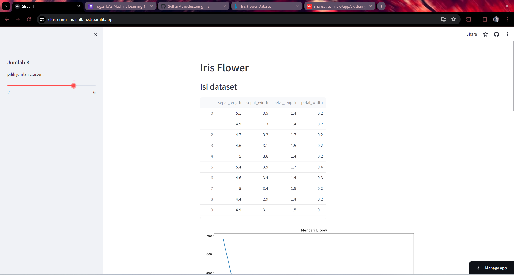

# Laporan Proyek Machine Learning

### Nama : Sultan Muhamad Taufik Mamur

### Nim : 211351142

### Kelas : Pagi B

## Domain Proyek

Dalam konteks proyek clustering ini kita mengelompokan jenis bunga iris, Dimana pengelompokan ini diciptakan menggunakan algorithma K-Means Clustering.

## Business Understanding

Web app ini dapat digunakan untuk memahami tanaman bunga iris. Dengan mengetahui bunga mana yang mendapatkan cluster berdasarkan petal dan sepal, untuk menentukan jenis iris.

### Problem Statements

Banyaknya perbedaan sepal dan petal pada bunga menjadikannya sulit untuk melakukan pengelompokan secara manual.

### Goals

berhasil mengelompokan bunga berdasarkan data petal dan sepal.

### Solution statements

Membuatkan web app yang bisa membuat mengelompokan secara otomatis menggunakan K-Means Clustering.

## Data Understanding

Dataset yang saya gunakan berasal jadi Kaggle yang berisi panjang dan lebar pada sepal dan petal.Dataset ini mengandung 150 baris dan 5 columns.<br>
Dataset = [Iris Flower](https://www.kaggle.com/datasets/arshid/iris-flower-dataset)

Selanjutnya menguraikan seluruh variabel atau fitur pada data

### Variabel-variabel pada Global Video Game Sales adalah sebagai berikut:

- sepal_length    (Menunjukan nomor id Produk)    (float64)
- sepal_width       (Menunjukan harga Produk)    (float64)
- petal_length        (Menunjukan penjualan Produk)    (float64) 
- petal_width      (Menunjukan tinggi Produk)   (float64) 
- species   (Menunjukan resolusi Produk)    (object)

## Data Preparation

Pada tahap ini saya akan menunjukkan visualisasi data dan melakukan preprocessing seperti pembersihan data.

### Data Collection

Untuk data collection ini, saya mendapatkan dataset yang nantinya digunakan dari website kaggle.

### import dataset

Pertama kita mengimport semua library yang dibutuhkan dan mendownload token kaggle akun kita,

```bash
import pandas as pd
import numpy as np
import seaborn as sns
import matplotlib.pyplot as plt
from sklearn.cluster import KMeans
```

Karena kita menggunakan google colab untuk mengerjakannya maka kita akan import files juga,

```bash
from google.colab import files
```

Lalu mengupload token kaggle agar nanti bisa mendownload sebuah dataset dari kaggle melalui google colab

```bash
file.upload()
```

Setelah mengupload filenya, maka kita akan lanjut dengan membuat sebuah folder untuk menyimpan file kaggle.json yang sudah diupload tadi

```bash
!mkdir -p ~/.kaggle
!cp kaggle.json ~/.kaggle/
!chmod 600 ~/.kaggle/kaggle.json
!ls ~/.kaggle
```

lalu mari kita download datasetsnya

```bash
!kaggle datasets download -d arshid/iris-flower-dataset -force
```

Selanjutnya kita harus extract file yang tadi telah didownload

```bash
!mkdir iris-flower-dataset
!unzip iris-flower-dataset.zip -d iris-flower-dataset
!ls iris-flower-dataset
```

Mari lanjut dengan memasukkan file csv yang telah diextract pada sebuah variable, dan melihat 5 data paling atas dari datasetsnya

### Data discovery
```bash
df = pd.read_csv('/content/iris-flower-dataset/IRIS.csv')
df.head()
```

Untuk melihat mengenai type data dari masing masing kolom kita bisa menggunakan property info,

```bash
df.info()
```

```bash
df.isnull().sum()
```
untuk melihat apakah data ada yang bermasalah/null.

```bash
df.describe()
```

### EDA

```bash
sns.heatmap(df.isnull())
```


```bash
plt.figure(figsize=(10,8))
sns.heatmap(df.corr(), annot=True)
```


```bash
x=df.species.value_counts()
plt.figure(figsize=(12, 10))
plt.pie(x, labels=x.index, autopct='%1.1f%%', startangle=90, colors=['purple', 'blue', 'yellow'])
plt.title('Most species in dataset')
plt.show()
```


```bash
sns.boxplot(x="species",y="petal_length",data=df)
plt.show()
```
melihat petal bunga apa yang paling panjang


```bash
plt.figure(figsize=(12,6))
sns.histplot(data=df,x=df.sepal_length,bins=20)
```
data panjang sepal dalam bentuk grafik


```bash
plt.figure(figsize=(12,6))
sns.histplot(data=df,x=df.petal_width,bins=20)
```
data lebar sepal dalam bentuk grafik


### Prepocessing

disini kita hapus data species
```bash
x = df.drop(['species'], axis = 1)
```

```bash
print (x)
```
kita akan memcari elbownya
```bash
clusters = []
for i in range(1, 10):
    km = KMeans(n_clusters=i).fit(x)
    clusters.append(km.inertia_)

fig, ax = plt.subplots(figsize=(12, 8))
sns.lineplot(x=list(range(1, 10)), y=clusters, ax=ax)
ax.set_title('Mencari Elbow')
ax.set_xlabel('Number of Clusters')
ax.set_ylabel('Inertia')

plt.show()
```

disini kita telah menemukan elbownya yaitu 3

### Modelling

disini kita akan mengcluster data atau mengelompokan data
```bash
n_clust = 3
kmean = KMeans(n_clusters=n_clust).fit(x)
x['Labels'] = kmean.labels_
```

```bash
plt.figure(figsize=(10, 8))

sns.scatterplot(x='sepal_length', y='petal_length', hue='Labels', size='Labels', markers=True, palette=sns.color_palette('hls', n_colors=n_clust), data=x)

for label in x['Labels']:
    plt.annotate(label,
                 (x[x['Labels'] == label]['sepal_length'].mean(),
                  x[x['Labels'] == label]['petal_length'].mean()),
                 horizontalalignment='center',
                 verticalalignment='center',
                 size=20, weight='bold',
                 color='black')

plt.show()
```


Data sudah berhasil kita clustering/kelompokkan.

kita lihat data yang telah kita clustering
```bash
print (x)
```

## Deployment
Klik link dibawah untuk membuka web

[Clust APP](https://clustering-iris-sultan.streamlit.app/).



